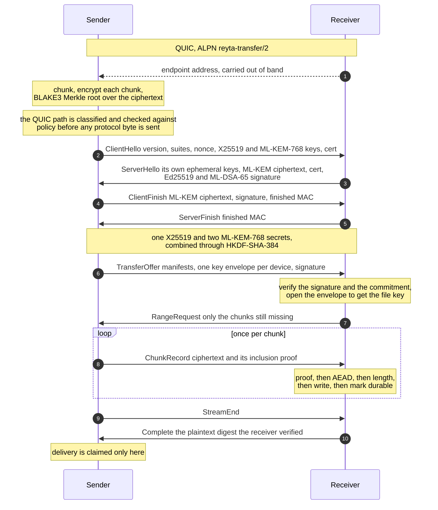

# Reyta Transfer Protocol 2.0

A working prototype of an end-to-end encrypted file transfer protocol for
moving files between devices, using hybrid post-quantum key exchange and
hybrid signatures.

## Status

This is a prototype. It is not ready for production use and should not be
shipped to users.

The core works and is heavily tested, but the release gates below are not met.
The most important one is that it has had no independent security review:
everything here was written and tested by the same people, which catches
regressions and does not catch blind spots.

Not met, each blocking a release:

| Gate | State |
|---|---|
| Independent security review | not started |
| Upstream known-answer vectors for the pinned PQC providers | not started |
| Fuzzing of the ABI and wire parsers | not started |
| Account recovery design | not started |
| Keystore backends | macOS only |
| Private relay infrastructure | uses a public bootstrap preset |

The protocol definition also has open questions: cases it does not yet cover,
and places where two implementations could diverge. Each is settled before the
affected subsystem is written, so that an ambiguity does not become behaviour
by accident. Section numbers in the source comments refer to that definition.

## Contents

| Path | What it is |
|---|---|
| `prototype/native/rtp2-core` | Rust core and the C ABI |
| `prototype/rtp2` | Go bindings over the C ABI |
| `prototype/cmd/rtp2` | Command line tool for moving a file |
| `prototype/examples` | Annotated end to end demonstration |

## Design

A Rust core owns every key, every cipher operation and the transport. The
application layer drives transfers through a narrow C ABI that no key material
ever crosses. An application holds opaque handles and receives public data:
address blobs, transfer reports, digests.

```
  +------------------------------------------------------------------+
  |  application layer            Go, Swift or C++                   |
  |                               product state, UI, policy input    |
  +---------------------------------+--------------------------------+
                                    |
                       C ABI v6     |  handles, paths, CBOR blobs
                       no key material crosses this line
                                    |
  +---------------------------------v--------------------------------+
  |  rtp2-core (Rust)                                                |
  |                                                                  |
  |   handshake      mutual device authentication, session keys      |
  |   keys           per-file key hierarchy, one sealed envelope     |
  |                  per recipient device                            |
  |   object         chunking, and authenticated encryption bound    |
  |                  to the object and the chunk index               |
  |   merkle         commitment over ciphertext, per-chunk proofs    |
  |                  bound to leaf position                          |
  |   manifest       what a relay may read, and what only the        |
  |                  recipient may                                   |
  |   resume         which chunks are verified, which are durable    |
  |   store          device identity at rest, sealed or not          |
  |   route          the observed path, and the policy that can      |
  |                  refuse it before the first byte is sent         |
  |   events         bounded progress queue, polled across the ABI   |
  +---------------------------------+--------------------------------+
                                    |
  +---------------------------------v--------------------------------+
  |  transport       Iroh 1.0.3, QUIC, ALPN reyta-transfer/2         |
  +------------------------------------------------------------------+
```

Pinned dependencies for the cryptography: BLAKE3 1.8.3, libcrux 0.0.10 for
ML-KEM-768 and ML-DSA-65 (FIPS 203 and 204), x25519-dalek, ed25519-dalek, and
XChaCha20-Poly1305 with HKDF and HMAC over SHA-384.

### A transfer, in order

The diagram above is what the parts are. This is what they do, and when.



Everything after ServerFinish is encrypted under the derived control keys and
carries an epoch and a counter, so no frame can be replayed or reordered. The
address in the first line is not a protocol message: it is a string the two
sides exchange however they like.

## What works

A real transfer between two devices over real QUIC, with these properties:

| Property | How it holds |
|---|---|
| Hybrid key agreement | X25519 and ML-KEM-768, both mandatory. Breaking one leaves the other standing. |
| Hybrid device signatures | Ed25519 and ML-DSA-65, both verified. |
| Chunk authenticity | XChaCha20-Poly1305, with the object context hash and the chunk index in the AAD. |
| Position binding | BLAKE3 Merkle proofs verify the leaf index and the direction sequence, so a valid chunk cannot be replayed at another index or from another object. |
| Resume | The receiver records verified ranges, not a byte offset, so an interrupted transfer re-fetches only what is missing. |
| Identity at rest | One 32-byte seed, optionally sealed under the platform keystore, or under a Secure Enclave key that cannot leave the machine. |
| Route control | The class of network path is reported, and an application can refuse a path it does not want. |

Designed but not yet implemented: asynchronous prekey mode and vault deposit,
the resumption exchange driven from the transport, HTTPS fallback, bound
session mode, device certificates and revocation, derivative objects and
stream maps, multi-source delivery, and private relay configuration.

## Building

Requires Rust 1.96 (pinned by `rust-toolchain.toml`), Go 1.23 or later, a C
compiler, and network access to fetch the pinned crates.

```
cd prototype
make native
```

## Moving a file

```
make cli
```

On the receiving machine:

```
bin/rtp2 -state ~/.rtp2 recv received.bin
```

It prints one line, the address to dial. On the sending machine:

```
bin/rtp2 -state ~/.rtp2 send <that address> video.mp4
```

Any file works. The protocol is content agnostic and chunks whatever it is
given; size is bounded only by disk. Both sides print the plaintext digest, the
ciphertext Merkle root, the peer device id and the route the bytes took.

| Flag | Effect |
|---|---|
| `-state <dir>` | Persist this device's identity across restarts |
| `-keystore` | Seal that identity under the platform keystore |
| `-route <p>` | `any`, `direct` or `loopback`; a path outside it is refused |
| `-resume <file>` | Keep resume state so an interrupted receive continues |
| `-timeout <d>` | How long `recv` waits for a peer |

Two modes need no second machine. `loop` runs both sides in one process, and
`hash` prints a file's BLAKE3:

```
bin/rtp2 -route loopback loop big.iso copy.iso
bin/rtp2 hash big.iso
```

A keystore-sealed device is retired by removing the wrapping key. Everything
sealed under it becomes unreadable, the identity included, so peers see a new
device the next time:

```
bin/rtp2 forget
```

## Running the example

```
make example                     # 3 MiB of random data
make example FILE=/path/to/file  # your own file
```

Two independent runtimes with two device identities open one real QUIC
connection. The program prints each protocol stage, then checks the outcome
against values recomputed outside the protocol: that each side authenticated
the other device rather than itself, that the Merkle root and plaintext digest
agree, that the received file is byte-identical, and that an independently
computed BLAKE3 matches.

## Testing

```
make check            # Go tests, Rust tests, mutation check
make e2e-bench        # whole-transfer throughput, with the route it measured
make transport-bench  # control: one QUIC stream, no RTP/2 code at all
```

232 Rust tests, 24 Go tests, and a mutation check that currently catches 93 of
93.

The mutation check is the part worth explaining, because a passing test suite
is weak evidence on its own. Each entry removes a real check from the source:
a skipped signature verification, a dropped AAD field, an unbounded queue, a
coerced proof direction. The run fails unless some test notices.

Three rules the runs have earned:

1. A stale pattern is a failure, not a skip. If a mutation's substitution no
   longer matches the source, that property went unchecked, so the run fails
   rather than printing a note.
2. A hang counts as caught. A mutation that makes the suite spin forever is a
   failure like any other, and without a watchdog one such entry silently
   retires every mutation after it.
3. A mutation nobody can kill is deleted, with the reason recorded. Keeping it
   would create the appearance of a check that does not exist.

Two bugs found this way are worth naming. An integer overflow turned a loop
infinite and was reachable from a single signed message. A Rust enum was passed
across `extern "C"` while the header declared one argument fewer, so a policy
value was read from an uninitialised register. Both compiled without a warning.
Both were found by writing a test that tried to pin a requirement, not by
reading the code.

## Performance

Measured on Apple silicon, 64 MiB, with `make throughput` and `make e2e-bench`:

| Stage | Rate |
|---|---:|
| Sender ceiling (AEAD twice, hash, Merkle leaves, proofs) | 225 MiB/s |
| Receiver ceiling | 238 MiB/s |
| End to end over loopback | 108 MiB/s |
| Raw QUIC stream, no RTP/2 code | 266 MiB/s |

Pin the path or the number means nothing. Two endpoints in one process do not
talk over loopback by default, and binding to `127.0.0.1` is not enough
either: the transport advertises globally routable addresses beside the
loopback one, and the dialer may take them. An earlier version of this file
quoted a figure that was measuring a VPN.

That is also why `-route loopback` does two things rather than one. It binds
the socket to loopback, so a loopback candidate exists at all, and it removes
every other address from what the endpoint advertises, so the peer cannot dial
a path that admission would then refuse. A policy that only rejected after
connecting would be a policy that never completed a transfer.

## Security

Report suspected vulnerabilities privately, through the Report a vulnerability
button on the Security tab, not as a public issue. Use synthetic test data.
Never include real file keys, device private keys, capability tokens, private
file content, or production endpoint tickets.

Three properties of the at-rest posture are worth stating plainly:

1. The default leaves the device seed in a 0600 file. Keystore protection is
   opt-in and macOS only so far.
2. Requesting keystore protection never degrades quietly. If the keystore
   cannot be used the runtime fails; it does not write a plaintext seed
   instead, and it does not drop from a hardware-backed key to a software one.
3. Losing the keystore item makes the device identity permanently unreadable.
   That is a deliberate refusal, because minting a new identity would change
   the device id and break every peer's trust-on-first-use pin. It is correct,
   and it is not yet a product: there is no account recovery design.

## License

Apache License 2.0. See `LICENSE`.
